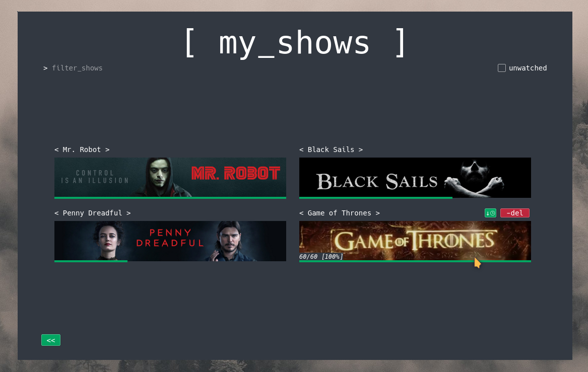

#Robin It

*Version 1.0*

Python GUI Application to search, track and download tvshows and movie torrents

--------------------------------

## Screenshots

*NOTE: screenshots were taken on KDE5 with Breeze theme, they may differ on other systems*

## Instalation

The python version used is python2.7, i will popssibly port it to python3.5 since PyQt5 only officially supports 3.5 if i'm not mistaken. The main dependencies are listed in the requirements.txt, and can be installed through:

 `pip install -r requirements.txt` *using pip for python2.7 (pip2)*

Python bindings for Qt5 can be installed through:

ubuntu: 	`apt-get install python-qt5` or ` python-pyqt5`

arch: 		`pacman -S python2-pyqt5`

## Usage

Run `python robinit_gui.py`

## [Changelog](https://github.com/3ximus/robin-it/blob/master/CHANGELOG.md)

## [Known Bugs](https://github.com/3ximus/robin-it/labels/bug)
